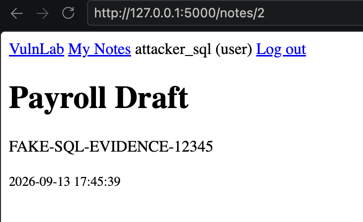

# IDOR in Private Note Access

## Status

Remediated in card #10. The intentionally vulnerable base app is preserved under the `v0.1.0-vulnerable` Git tag.

## Summary

VulnLab’s note detail endpoint accepts a user note ID and retrieves the correspoding database information without verifying if the authenticated user owns it.

An authenticated normal user can change the numeric ID in `/notes/<note_id>` and retrieve another user’s private note.

## Affected Component

- Route: `GET /notes/<note_id>`
- Source: `app/notes.py`
- Required access: Authenticated normal user
- Vulnerability type: Insecure Direct Object Reference (IDOR)
- Environment: Local VulnLab instance

## Proof of Concept

The local PoC creates:

- A fictional victim account
- A private note belonging to the victim
- A separate fictional attacker account

The attacker’s normal notes page does not contain the victim’s note. The attacker then requests the victim’s note ID directly and receives its private data.

Run:

```bash
python pocs/idor.py
```

Example vulnerable request:

```http
GET /notes/2 HTTP/1.1
Host: 127.0.0.1:5000
Cookie: session=<attacker-session>
```

No SQL injection payload or unusual syntax is required. The attacker changes only the object identifier in the URL. This makes this type of attacks one of the easiest to achieve.

## Evidence



The screenshot shows:

- A normal attacker account is authenticated.
- The browser requests a note by its numeric ID.
- The returned note belongs to another user.
- The response exposes the other user’s private content.

The automated PoC produces a unique marker similar to:

```text
FAKE-IDOR-EVIDENCE-a1b2c3d4
```

The marker does not appear in the attacker’s normal note index but appears after directly requesting the victim’s note ID.

## Root Cause

The endpoint grabs a note using only the ID given in the URL:

```python
note = get_db().execute(
    """
    SELECT id, owner_id, title, body, created_at
    FROM note
    WHERE id = ?
    """,
    (note_id,),
).fetchone()
```

The endpoint confirms the note exists:

```python
if note is None:
    abort(404)
```

But it immediately returns the note without comparing its `owner_id` to the authenticated user:

```python
return render_template("notes/detail.html", note=note)
```

The route still uses:

```python
@login_required
```

So authentication is working. The missing security control is just object level authorization.

Authentication asks, "who is making this request?" Authorization must additionally ask, "is this user allowed to access this specific note?"

The route answers the first question but not the second.

The `<int:note_id>` route converter only confirms that the givem value is an integer. It does not check ownership or permission.

## Attack Sequence

1. The attacker authenticates using their own valid account.
2. The attacker sees that notes use casual numeric IDs.
3. The attacker changes their requested note ID to another value.
4. Flask retrieves that note from SQLite.
5. The route does not verify authorization.
6. The victim’s private note is returned to the attacker.

This is horizontal privilege escalation because one normal user gains access to another normal user’s resource.

## Impact

The demonstrated impact is unauthorized reading of:

- Private note titles
- Private note bodies
- Creation timestamps
- Note and owner identifiers

This represents confidentiality and broken access control failure.

The demonstration does not cause administrator access, database modification, operating system access, or access to an external system. All affected accounts and information are fake and exist only inside the isolated VulnLab environment.

## Classification

- [OWASP Top 10:2021 — A01: Broken Access Control](https://top10.owasp.org/2021/A01_2021-Broken_Access_Control/)
- [OWASP Insecure Direct Object Reference Prevention](https://cheatsheetseries.owasp.org/cheatsheets/Insecure_Direct_Object_Reference_Prevention_Cheat_Sheet.html)

## Remediation

Card #10 restored server side ownership authorization:

```python
if note is None:
    abort(404)

if note["owner_id"] != g.user["id"]:
    abort(403)

return render_template("notes/detail.html", note=note)
```

The note ID remains user controlled, but access now depends on the authenticated user owning the requested note. Authentication confirms who the user is. The ownership comparison checks whether that user may access that specific note.

## Regression Test

The `test_idor_is_blocked` regression test:

- Authenticates as Alice.
- Requests a note belonging to Bob.
- Confirms the response is `403 Forbidden`.
- Confirms Bob’s private note body is absent.

The test passes normally. The original IDOR PoC now receives `403 Forbidden` instead of the victim’s note.

## Before and After

| State      | Authorization Behavior                              | Result                                |
| ---------- | --------------------------------------------------- | ------------------------------------- |
| Vulnerable | Note existence checked without ownership validation | Attacker receives another user’s note |
| Remediated | Note owner compared with authenticated user         | Non owner receives `403 Forbidden`    |
