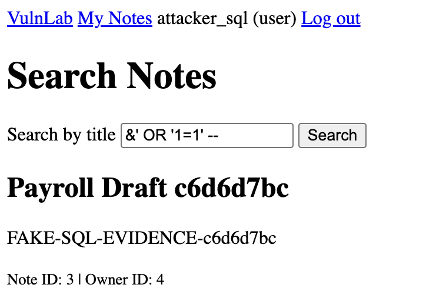

# SQL Injection in Private Note Search

## Status

Remediated in card #10. The intentionally vulnerable base app is preserved under the `v0.1.0-vulnerable` Git tag.

## Summary

VulnLab’s authenticated note search endpoint inserts user input directly into the SQL query. An authenticated normal user can change the query’s logic and access notes belonging to other users.

## Affected Component

- Route: GET /notes/search?q=
- Source: app/notes.py
- Required access: Authenticated normal user
- Environment: Local VulnLab instance

## Proof of Concept

The local PoC creates unique fake victim and attacker accounts, creates a private victim note, and does two searches:

1. A normal search that does not expose the victim note
2. An injected search that exposes the victim note

Run:

```bash
python pocs/sql_injection.py
```

Payload:

```text
%' OR 1=1 -- 
```

## Evidence



The authenticated attacker_sql account retrieved notes with different owner IDs, including the fake marker:

```text
FAKE-SQL-EVIDENCE-12345
```

The control search did not return the victim’s note. The injected search returned both the attacker’s content and a note belonging to another user.

## Root Cause

The vulnerable route creates SQL using an f-string:

```python
query = f"""
    SELECT id, owner_id, title, body, created_at
    FROM note
    WHERE owner_id = {g.user["id"]}
      AND title LIKE '%{search_term}%'
    ORDER BY created_at DESC, id DESC
"""
```

Because ```search_term``` is inserted directly into the SQL string, user data can become executable SQL syntax.

The payload changes the query into logic equivalent to:

```sql
WHERE owner_id = 1
  AND title LIKE '%%'
  OR 1=1 -- %'
```

The payload works as follows:

- ```%``` acts as a wildcard for the ```LIKE``` operation.
- ```'``` closes the application’s intended search string.
- ```OR 1=1``` adds a condition, which is always true.
- ```--``` comments out the remaining SQL.

Because SQL evaluates ```AND``` before ```OR```, the effective condition becomes:

```sql
(owner_id = 1 AND title matches) OR true
```

Every note therefore satisfies the query, including notes that do not belong to the authenticated user.

## Impact

The demonstrated impact is unauthorized reading of:

- Private note titles
- Private note bodies-
- Note IDs
- Owner IDs

This represents a confidentiality and access-control failure.

The demonstration does not cause database modification, deletion, operating system command execution, or access to any external system. All affected accounts and data are fake and exist only inside the isolated local VulnLab environment.

## Classification

- [OWASP Top 10:2021 — A03: Injection](https://top10.owasp.org/2021/A03_2021-Injection/)
- [CWE-89 — Improper Neutralization of Special Elements Used in an SQL Command](https://cwe.mitre.org/data/definitions/89.html)

## Remediation

Card #10 replaced the dynamic SQL construction with a parameterized query:

```python
search_pattern = f"%{search_term}%"

notes = get_db().execute(
    """
    SELECT id, owner_id, title, body, created_at
    FROM note
    WHERE owner_id = ?
      AND title LIKE ?
    ORDER BY created_at DESC, id DESC
    """,
    (g.user["id"], search_pattern),
).fetchall()
```

SQLite now receives the SQL instructions separately from the search data. Characters such as `'`, `--`, and `OR` become part of the search value instead of the SQL syntax.

## Regression Test

The `test_search_blocks_sql_injection` regression test showcases:

- A legitimate search still returns the authenticated user’s matching note.
- Another user’s note is not returned.
- The original SQL injection data does not expose another user’s title / body.

The original PoC now exits unsuccessfully because the victim’s data marker is not returned.

## Before and After

| State      | Query Construction                       | Result                                                           |
| ---------- | ---------------------------------------- | ---------------------------------------------------------------- |
| Vulnerable | User input inserted through an f-string  | Injected search returns other users’ notes                       |
| Remediated | SQL placeholders and separate parameters | Payload is treated as text and other users’ notes remain private |
